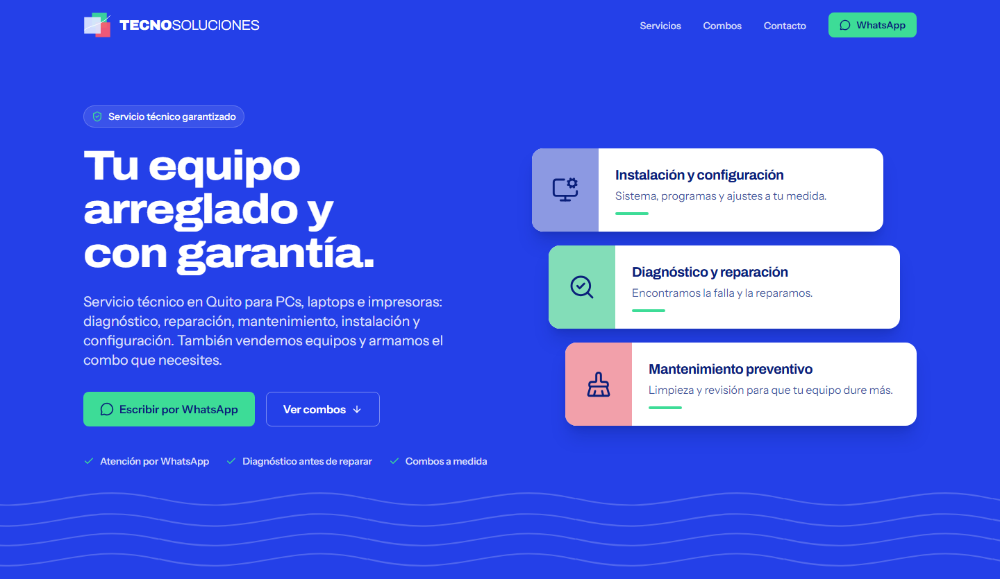
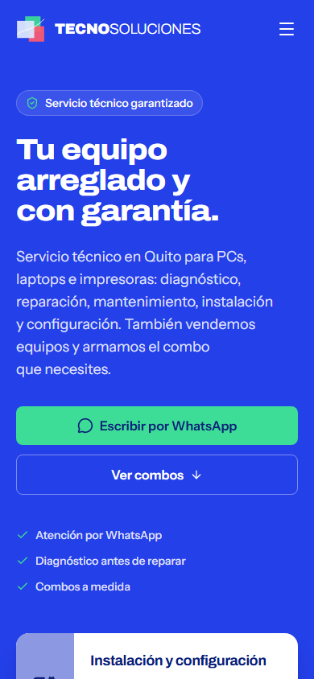
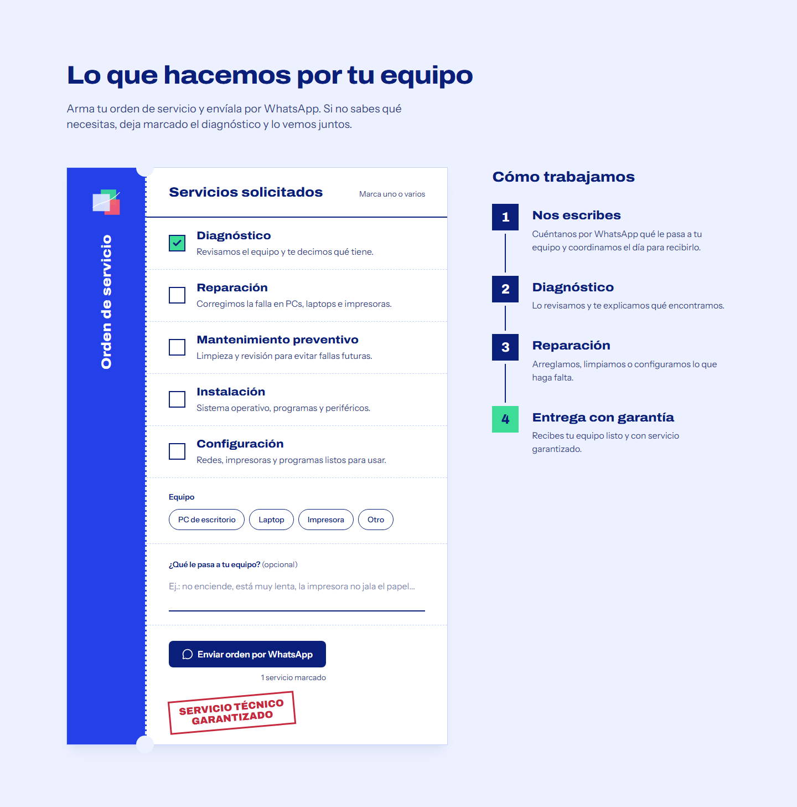
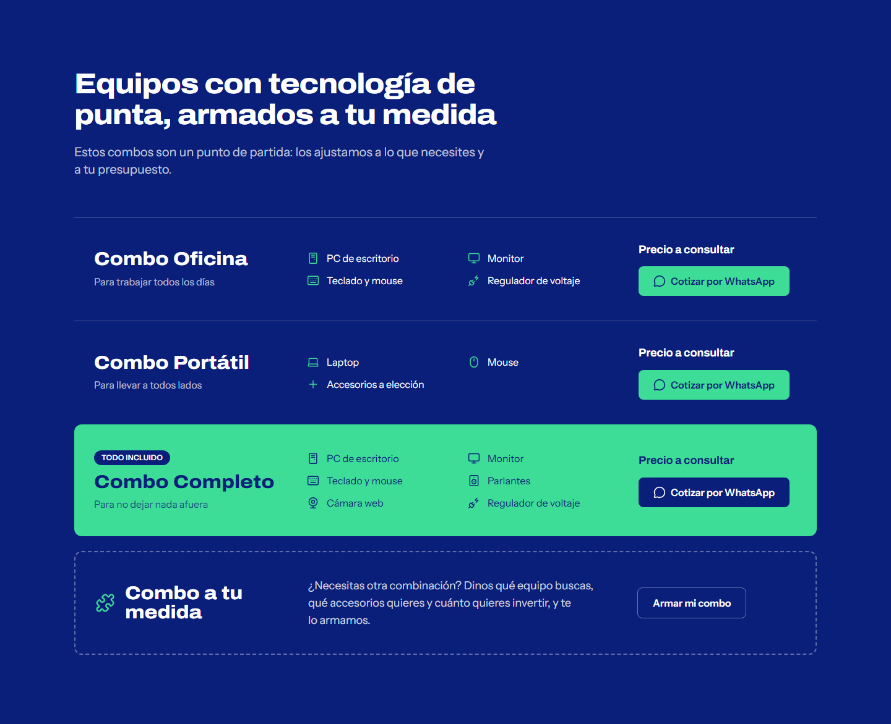

<p align="center">
  
</p>

<h1 align="center">Tecnosoluciones</h1>

<p align="center">
  Landing page para un servicio técnico de computadoras en Quito, Ecuador.<br>
  Convierte cada visita en una conversación de WhatsApp.
</p>

<p align="center">
  
  
  
</p>

<p align="center">
  <strong>Demo:</strong> <a href="https://tecnosoluciones-5t8.pages.dev/">tecnosoluciones-5t8.pages.dev</a>
</p>

---

## Contexto

Tecnosoluciones es un negocio de Quito que ofrece reparación, mantenimiento, diagnóstico, instalación y configuración de PCs, laptops e impresoras, además de venta de equipos en combos a medida. Tras cerrar su local físico, todo el contacto con clientes pasa por WhatsApp, pero el negocio no tenía presencia en internet.

Este proyecto le da un sitio propio, rápido y pensado para el celular, cuyo único objetivo es que el cliente escriba por WhatsApp con la información que el técnico necesita para responder.

## Capturas

<p align="center">
  
  
</p>

<p align="center">
  
  
</p>

## Funciones principales

- **Orden de servicio interactiva:** el cliente marca los servicios, elige el tipo de equipo y describe el problema; el sitio arma un mensaje ordenado y abre WhatsApp con él.
- **Combos de equipos** con cotización por WhatsApp, cada uno con su mensaje prellenado, y una opción para pedir un combo a medida.
- **Código QR** en la sección de contacto para escribir desde el celular cuando se visita el sitio en una computadora.
- **Diseño responsive** (mobile-first), con menú hamburguesa en móvil y navegación fija.
- **SEO y vista previa al compartir:** título, descripción, Open Graph y favicon con la marca.

## Stack tecnológico

- React 19 + Vite
- Tailwind CSS 4 (`@tailwindcss/vite`), con los colores y tipografías de la marca como tokens en `@theme`
- [lucide-react](https://lucide.dev/) para iconos y [qrcode.react](https://github.com/zpao/qrcode.react) para el código QR
- ESLint + Prettier
- Sin backend: sitio estático

## Decisiones técnicas

- **El contenido vive en datos, no en los componentes.** Servicios, pasos y combos están en `src/data/`, y los componentes los recorren con `.map()`. Para cambiar un texto o añadir un combo no hace falta tocar JSX.
- **WhatsApp en un solo lugar.** El número y la función `waLink(mensaje)` están en `src/config/contact.js`. Todos los botones, la orden de servicio y el QR salen de ahí, así que cambiar el número es una línea.
- **Sin datos falsos en producción.** Lo que el negocio aún no ha confirmado (precios, zona) no se muestra con placeholders: los combos sin precio muestran "Precio a consultar" y los datos de contacto vacíos simplemente se ocultan.
- **Accesibilidad desde el inicio.** HTML semántico, formularios con `fieldset` y `label` reales, foco visible en todos los controles, contraste AA y animaciones que respetan `prefers-reduced-motion`.
- **Identidad propia, no plantilla.** El diseño parte del letrero original del negocio (tres cuadrados translúcidos y ondas) y evita el aspecto genérico de las landing pages hechas con plantillas.

## Instalación

Requisitos: Node.js 20 o superior.

```bash
git clone <url-del-repositorio>
cd tecnosoluciones
npm install
npm run dev
```

| Comando | Descripción |
|---|---|
| `npm run dev` | Servidor de desarrollo |
| `npm run build` | Build de producción en `dist/` |
| `npm run preview` | Previsualiza el build |
| `npm run lint` | Revisa el código con ESLint |

## Estructura del proyecto

```
src/
├── components/     # Secciones (Navbar, Hero, Services, Combos, Contact, Footer) y piezas reutilizables
├── config/
│   └── contact.js  # Número de WhatsApp, datos de contacto y waLink()
├── data/
│   ├── services.js # Servicios, orden de servicio y pasos de trabajo
│   └── combos.js   # Combos de equipos
└── index.css       # Tokens de marca (@theme) y estilos base
```

## Autor

Desarrollado por **Leandro Rubio**.

[Portafolio](https://leandrorubio-73456.github.io/portafolio/) · [LinkedIn](https://www.linkedin.com/in/leandro-rubio-369651367/) · leandrorubio456@gmail.com

## Licencia

El código se comparte con fines de portafolio. La marca, los textos y las imágenes pertenecen a Tecnosoluciones.
